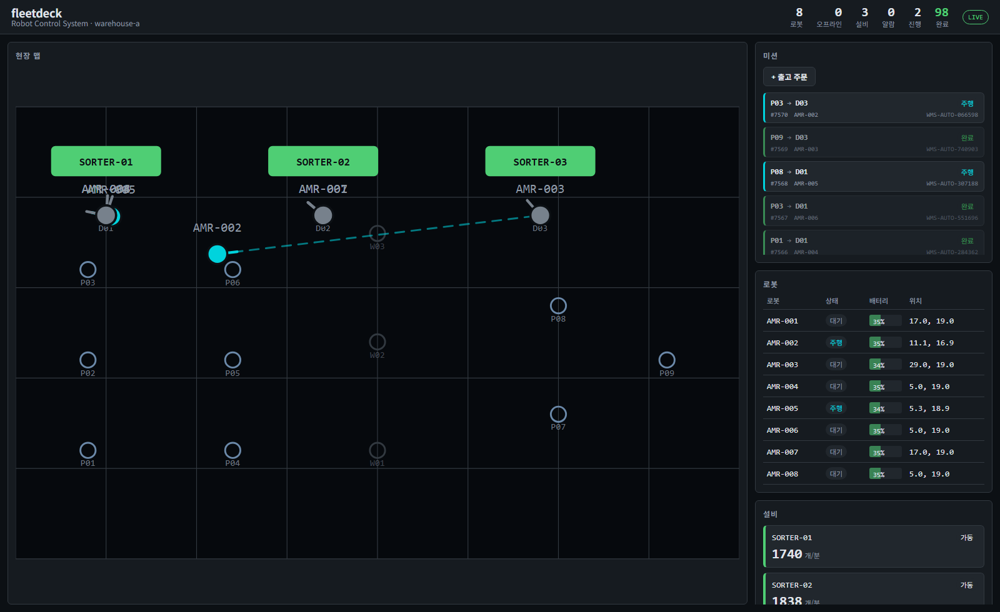
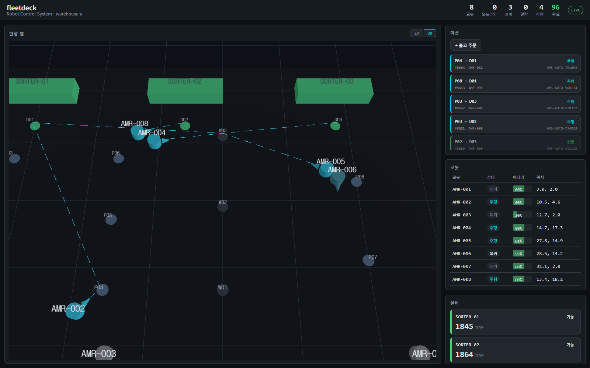

# fleetdeck

물류 현장의 **AMR(자율이동로봇)과 분류 설비(소터·컨베이어)를 한 화면에서 관제**하는
RCS(Robot Control System)입니다.

실제 로봇 없이, VDA5050 규격을 따르는 시뮬레이터가 MQTT로 텔레메트리를 발행하고
Spring Boot 관제 서버가 수집·저장·중계하며 React 대시보드가 실시간으로 그립니다.
**WMS 주문이 들어와 로봇이 주행하고 완료 보고가 돌아오기까지 제어 루프가 닫혀 있습니다.**



맵에는 창고 노드(입고 `P*`, 투입 `D*`, 경유 `W*`), 소터 설비, 로봇의 현재 위치와
주행 중인 경로가 함께 그려집니다. 우측은 미션 큐, 로봇 상태, 설비 처리량,
그리고 최근 30분 시계열입니다.

같은 데이터를 3D 로도 봅니다. 헤더에서 전환하거나 `?view=3d` 로 바로 열 수 있습니다.



```
                              ┌───────────────┐
                              │   mosquitto   │
                              └───┬───────┬───┘
        MQTT state / equipment    │       │   MQTT order (QoS 1)
                    ┌─────────────┘       └─────────────┐
                    ▼                                   │
┌──────────────────────────────┐                        │
│  backend (RCS)               │                        │
│  Spring Integration MQTT     │                        │
│    → TimescaleDB 적재         │                        │
│    → 미션 상태 전이            │                        │
│    → 디스패처 ────────────────┼────────────────────────┘
│  Spring Boot 3.5 / Java 17   │
└──────┬────────────────┬──────┘                ┌──────────────┐
       │ STOMP/WS       │ REST                  │  simulator   │
       ▼                ▼                       │  AMR x N     │
┌──────────────────────────────┐                │  sorter x M  │
│  frontend  React 18 + TS     │                │  Python 3.12 │
│  SVG 2D 맵 / 미션·로봇·설비    │                └──────────────┘
└──────────────────────────────┘
```

## 미션 생명주기

이 프로젝트의 핵심입니다. 상위 시스템의 출고 주문이 로봇 주행으로 이어지고
완료가 되돌아오는 전 구간이 동작합니다.

```
WMS 주문 ──▶ PENDING ──▶ ASSIGNED ──▶ RUNNING ──▶ DONE
              ▲            │            │
              │            └─ VDA5050 order 발행 (nodePosition 포함)
              │                         │
              └── 회수 ◀── 60초 진전 없음 ─┘        재시도 3회 초과 ──▶ FAILED
```

| 전이 | 판단 근거 |
|------|-----------|
| PENDING → ASSIGNED | 유휴이고 예약되지 않은 로봇 중 배터리 최대 |
| ASSIGNED → RUNNING | 로봇 state 의 `nodeStates` 가 차거나 `driving=true` |
| RUNNING → DONE | `nodeStates` 가 비고 `driving=false` (VDA5050 order 완료 조건) |
| → FAILED | 로봇 에러 보고, 또는 재시도 상한 초과 |
| ASSIGNED/RUNNING → PENDING | 60초간 진전 없음. 단 배정 로봇이 해당 order 수행 중이면 제외 |

**중복 배정 차단** — `RobotRegistry` 는 텔레메트리가 올 때만 갱신되므로, 한 번의 디스패치
패스에서 같은 로봇이 연속으로 뽑힐 수 있습니다(실제로 발생했던 버그). order 발행 전에
로봇을 예약해 후보에서 제외하고, 로봇이 해당 `orderId` 를 보고하면 해제합니다.

## 구성

| 폴더 | 역할 | 스택 |
|------|------|------|
| `simulator/` | 가상 AMR(order 수행)·소터 상태 발행, OPC UA 서버 | Python 3.12, paho-mqtt, asyncua, uv |
| `backend/` | MQTT·OPC UA 수집 → 적재 → 중계, 미션 API·디스패처·생명주기 | Spring Boot 3.5, Spring Integration, Milo, JDBC, Flyway |
| `frontend/` | 실시간 대시보드 (2D/3D 맵, 미션·로봇·설비 패널, 시계열 차트) | React 18, Vite, TypeScript, @stomp/stompjs, three |
| `infra/` | Mosquitto 설정 | eclipse-mosquitto 2 |
| `docs/` | 범위, 판단 근거, 측정 기록 | Markdown |

DB 스키마는 `backend/src/main/resources/db/migration/` 의 Flyway 마이그레이션이 관리합니다.

## 빠른 시작

```bash
cp .env.example .env
```

```bash
docker compose up -d --build
```

```bash
cd frontend && npm install && npm run dev
```

대시보드는 http://localhost:5173 입니다 (포트가 사용 중이면 Vite 가 5174 등으로 올립니다).
백엔드는 호스트 **8081** 에 노출됩니다 — 8080 을 다른 프로젝트가 쓰는 경우가 있어서입니다.
`BACKEND_PORT` 로 바꿀 수 있습니다.

기본 설정에서는 모의 WMS 생성기가 12초마다 출고 주문을 만들어 넣으므로,
띄우자마자 로봇이 움직이는 것을 볼 수 있습니다. 대시보드의 `+ 출고 주문` 버튼으로
직접 만들 수도 있습니다. 실제 상위 시스템을 붙일 때는 `FLEETDECK_WMS_ENABLED=false` 로 끕니다.

## API

| 메서드 | 경로 | 내용 |
|--------|------|------|
| GET | `/api/robots` | 로봇 최신 상태 전체 |
| GET | `/api/robots/{serial}` | 로봇 하나 |
| GET | `/api/equipment` | 설비 최신 상태 |
| GET | `/api/missions` | 최근 미션 100건 |
| POST | `/api/missions` | 미션 생성 (`{type, fromNode, toNode, sourceRef}`) |
| GET | `/api/map/nodes` | 창고 노드 좌표 |
| GET | `/api/history/sensor?channel=` | 센서 채널 추이 (time_bucket 집계) |
| GET | `/api/history/sensor-channels` | 수집 중인 채널 목록 |
| GET | `/api/alarms` | 최근 FDC 경보 |
| WS | `/ws` | STOMP. `/topic/robots`, `/topic/equipment`, `/topic/missions`, `/topic/alarms` 구독 |

## 설비 연동 프로토콜

설비는 MQTT 와 OPC UA 두 경로로 들어오고, 어댑터를 지나면 구분이 없어집니다 —
같은 레지스트리·같은 하이퍼테이블·같은 WebSocket 토픽을 탑니다.
`equipment_state_log.source` 로만 어느 쪽으로 들어왔는지 남습니다.

| 설비 | 프로토콜 | 수집 |
|------|---------|------|
| `SORTER-nn` | MQTT `fleetdeck/equipment/{id}/state` | Spring Integration MQTT |
| `UA-SORTER-nn` | OPC UA `opc.tcp://simulator:4840` | Milo 클라이언트 (탐색 → 구독) |

NodeId 는 박지 않고 Equipment 폴더를 브라우징해 찾습니다. 구독 알림은 변수 단위로
오므로 설비 단위로 병합해 내보냅니다(초당 12건 → **1.98건** 실측).
자세한 것은 [docs/021-opcua.md](docs/021-opcua.md).

## MQTT 토픽

| 토픽 | 방향 | QoS | 내용 |
|------|------|-----|------|
| `uagv/v2/{manufacturer}/{serial}/state` | robot → RCS | 0 | VDA5050 state (위치, 배터리, `nodeStates`, 에러) |
| `uagv/v2/{manufacturer}/{serial}/order` | RCS → robot | 1 | VDA5050 order (노드·엣지, `nodePosition` 포함) |
| `uagv/v2/{manufacturer}/{serial}/instantActions` | RCS → robot | 1 | 즉시 명령 (미구현) |
| `fleetdeck/equipment/{id}/state` | equipment → RCS | 0 | 소터·컨베이어 상태 (가동/정지/알람, 처리량) |

## 측정 결과

단일 노트북(8 vCPU / 15.4 GB, Docker Desktop WSL2)에서 compose 스택 전체를 띄운 채 측정했습니다.

| 구성 | 처리량 | 백엔드 CPU | DB CPU | 백엔드 메모리 |
|------|--------|-----------|--------|--------------|
| 로봇 5 / 소터 2 / 1 Hz | 초당 7건 | 1.7 % | 3.9 % | 349 MB |
| 로봇 30 / 소터 6 / 1 Hz | 초당 36건 | 2.6 % | 1.7 % | 355 MB |
| 로봇 50 / 소터 6 / 5 Hz | **초당 282건** | 12.5 % | 12.2 % | 355 MB |

기대치와 실측이 일치하고(252 vs 250) CPU 12 % 대에 머물러 **처리 경로에서는 병목을
찾지 못했습니다.** MQTT QoS 0 유실은 `headerId` 연속성으로 실측해
3분간 44,919건 중 17건(**0.038 %**)으로 확인했습니다.

자세한 방법과 재현 절차는 [docs/010-load-test.md](docs/010-load-test.md) 참고.

## 설정

| 키 | 환경변수 | 기본값 | 내용 |
|----|----------|--------|------|
| `fleetdeck.dispatch.interval` | `FLEETDECK_DISPATCH_INTERVAL` | 3s | PENDING 재배정 주기 |
| `fleetdeck.dispatch.stale-after` | `FLEETDECK_STALE_AFTER` | 60s | 회수 기준 (로봇 예약 TTL 겸용) |
| `fleetdeck.dispatch.max-retries` | `FLEETDECK_MAX_RETRIES` | 3 | 재시도 상한. 초과 시 FAILED |
| `fleetdeck.robot.offline-after` | `FLEETDECK_OFFLINE_AFTER` | 15s | 이 시간 무보고 시 OFFLINE. 배정 후보 제외 |
| `fleetdeck.robot.evict-after` | `FLEETDECK_EVICT_AFTER` | 5m | 이 시간 무보고 시 레지스트리에서 제거 |
| `fleetdeck.wms.enabled` | `FLEETDECK_WMS_ENABLED` | true | 모의 WMS 주문 생성기 |
| `fleetdeck.wms.interval` | `FLEETDECK_WMS_INTERVAL` | 12s | 주문 생성 주기 |
| `SIM_ROBOT_COUNT` / `SIM_SORTER_COUNT` | — | 8 / 3 | 시뮬레이터 규모 |

## 테스트

```bash
cd backend && ./gradlew test
```

```bash
cd backend && ./gradlew integrationTest
```

```bash
cd simulator && uv run pytest
```

**단위 테스트** — 백엔드 43개, 시뮬레이터 20개. Docker 없이 돕니다.
상태 전이·로봇 선정·재시도 판정은 순수 함수로 분리해 덮었습니다.

**통합 테스트** — 13개. Testcontainers 로 실제 Mosquitto·TimescaleDB 를 띄워
MQTT → 적재 → 미션 전이 → order 발행 → STOMP 브로드캐스트까지 흘려봅니다
(`@Tag("integration")` 으로 분리되어 `test` 태스크에서는 제외됩니다).
빈 DB 에 Flyway 가 V1 을 적용하므로 마이그레이션도 함께 검증됩니다.

지금까지 잡은 결함(중복 배정, 유령 로봇, order 의 `nodePosition` 누락)은 모두
단위 테스트를 통과하고 통합 구간에서만 드러났습니다. 그래서 다음을 직접 확인합니다.

- 디스패처가 실제로 order 를 발행하고, 그 order 에 주행 가능한 `nodePosition` 이 들어 있는가
- 로봇 보고에 따라 미션이 ASSIGNED → RUNNING → DONE 으로 전이하는가
- 한 로봇이 열린 미션을 둘 이상 갖지 않는가
- 깨진 JSON 이 파이프라인을 죽이지 않는가
- 대시보드가 구독하는 STOMP 프레임이 실제로 나가고, `online`/`lastSeenAt` 이
  평탄화되어 실리는가 (여기가 깨지면 화면의 모든 로봇이 오프라인으로 보인다)

## 알려진 한계

- **경로 계획이 얕습니다.** 통로를 가로지르는 이동에는 경유점을 하나 끼우지만,
  같은 쪽 안에서는 직행이라 랙 사이를 지날 수 있습니다. 통행 가능 그래프 위의
  A* 탐색과 교통 제어(같은 통로에서 마주치는 경우)는 다루지 않습니다.
- **인증·권한이 없습니다.** 단일 사용자 로컬 도구를 전제로 합니다.
  Mosquitto 익명 접속 허용, WebSocket 오리진 전체 허용 상태입니다.
- **히스토리 조회 API 가 없습니다.** 텔레메트리를 TimescaleDB 에 쌓지만 화면은
  최신값만 씁니다. 시계열을 보여주는 차트가 없습니다.

## 로드맵

- [x] 레포 골격, Compose, VDA5050 state 발행/구독
- [x] TimescaleDB 적재, 로봇/설비 REST 조회
- [x] STOMP 브로드캐스트, React 2D 맵
- [x] 설비 상태 패널, 알람 표시
- [x] 미션 API, 디스패처, 모의 WMS 주문
- [x] 미션 생명주기 (주문 → 배정 → 주행 → 완료)
- [x] 중복 배정 차단, 정체 회수, 재시도 상한
- [x] Flyway 스키마 관리
- [x] 부하 테스트 (초당 282 메시지)
- [x] 로봇 OFFLINE 상태, 유령 로봇 제거
- [x] Testcontainers 통합 테스트
- [x] 시계열 히스토리 API 와 차트 (time_bucket 집계)
- [x] Three.js 3D 뷰 (2D/3D 전환, 지연 로딩)
- [x] 통로 경유점 삽입
- [x] OPC UA 설비 연동 (탐색·구독·폴링, 알림 병합)
- [x] FDC 연속 센서 채널, 이상 주입 4종, 탐지기 3종 비교 채점
- [x] 센서·경보·정답라벨 적재, 수집 경로에 탐지기 연결, `/topic/alarms` 중계
- [x] 이상 감지 패널·센서 채널 차트, 경보 히스테리시스
- [ ] A* 경로 계획, 교통 제어

제조 도메인 확장(SPC/FDC/RMS/Oracle)은 [docs/020-manufacturing-scope.md](docs/020-manufacturing-scope.md) 참고.
측정 기록은 [021 OPC UA](docs/021-opcua.md), [022 FDC 탐지기 비교](docs/022-fdc-detection.md),
[023 대시보드와 경보 깜빡임](docs/023-dashboard-and-flapping.md).

범위와 판단 근거는 [docs/000-scope.md](docs/000-scope.md) 참고.

## 라이선스

[MIT](LICENSE)
